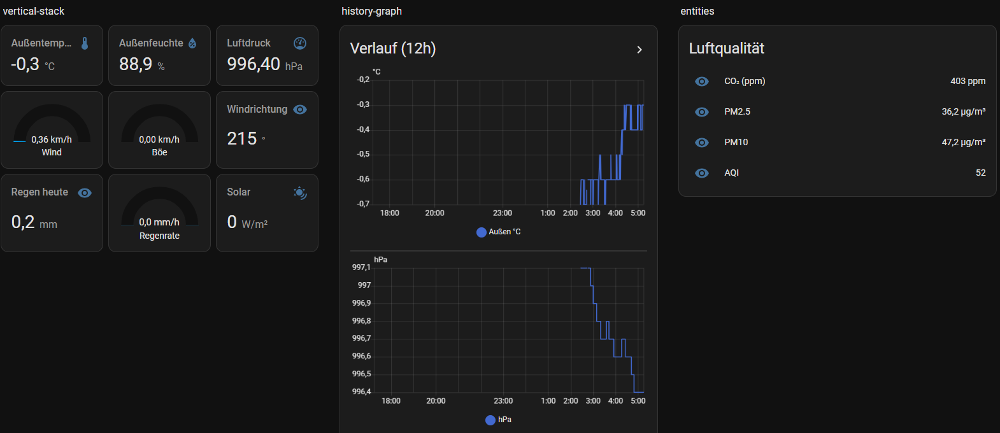
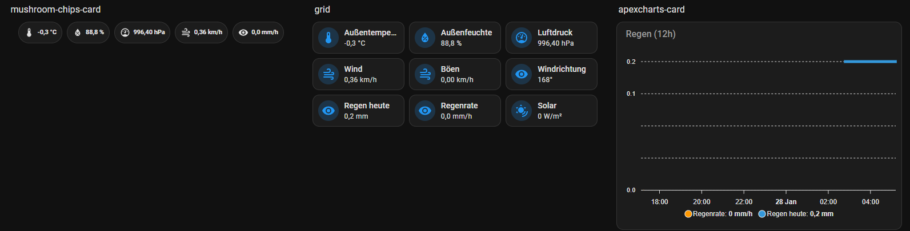
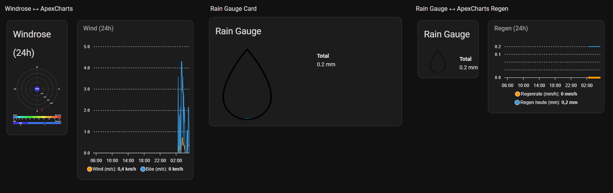
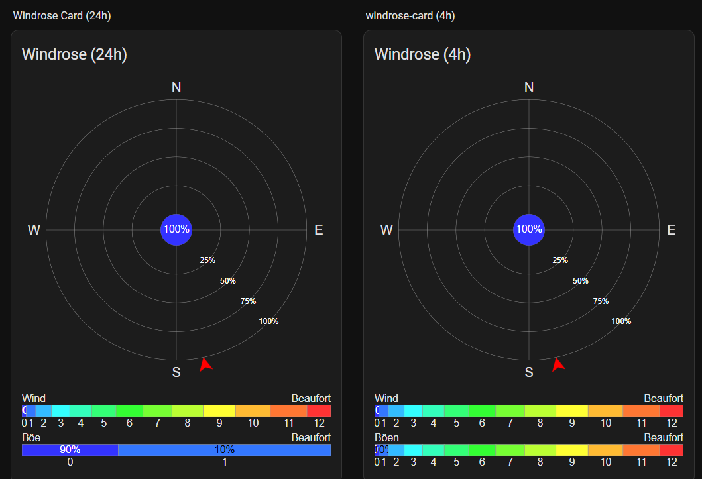
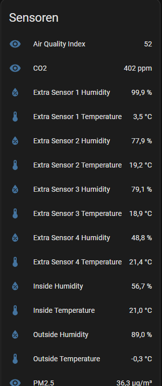

# WeatherDuino (Local JSON) – Home Assistant Integration

A custom Home Assistant integration for **WeatherDuino** receivers that expose their data via a local HTTP JSON endpoint (default: `/json`).

The integration is configured entirely via **Config Flow (UI)**:  
enter the IP/hostname → sensors are created automatically.

Repository:  
https://github.com/Sundancer78/weatherduino-homeassistant

---

## Features

- Fully local
- Config Flow (UI-based setup)
- Automatic sensor creation
- Clean naming:
  - Device name from JSON field `ID` (fallback: host)
  - Sensor names without `WeatherDuino <IP>` prefixes
- Dashboard examples with full Lovelace YAML
- Wind, rain, air quality, soil & extra sensors supported

---

## Requirements

- Home Assistant (Core / OS / Supervised)
- WeatherDuino reachable in the local network
- JSON endpoint available (default: `/json`)
- Recorder enabled (recommended for charts)

---

## Installation

### HACS (Custom Repository)

1. HACS → **Integrations**
2. Menu (⋮) → **Custom repositories**
3. Add repository URL  
   `https://github.com/Sundancer78/weatherduino-homeassistant`  
   Category: **Integration**
4. Install
5. Restart Home Assistant
6. Settings → **Devices & Services** → **Add Integration**
7. Search for **WeatherDuino (Local JSON)**

---

## Disclaimer

This is an **unofficial Home Assistant integration** developed by the community.
It has **no relation to the official WeatherDuino manufacturer** and is **not supported or endorsed by them**.

The integration communicates exclusively with the device’s local JSON interface.

---

## Configuration (UI)

- Host / IP (e.g. `192.168.1.240`)
- Port (default: `80`)
- Path (default: `/json`)
- Scan interval (default: `30s`)

---

## Recommended Lovelace Cards (HACS)

The dashboards below use:

- **Mushroom Cards**
- **ApexCharts Card**
- **Windrose Card**
- **Rain Gauge Card**
- **Layout Card**

Optional:
- **card-mod**

---

## Screenshots

Screenshots are located in the `Screenshots/` folder.

### 1) Overview – Classic Dashboard


### 2) Status & Quick Values (Mushroom + ApexCharts)


### 3) Rain Monitoring (Rain Gauge + ApexCharts)


### 4) Wind Analysis (Windrose)


### 5) All Sensors (Entities)


---

# Lovelace YAML – COMPLETE CODE PER SCREENSHOT

All examples below use these entity IDs (adjust if needed):

- `sensor.rx_weatherduino_4pro_outside_temperature`
- `sensor.rx_weatherduino_4pro_outside_humidity`
- `sensor.rx_weatherduino_4pro_pressure`
- `sensor.rx_weatherduino_4pro_wind_speed`
- `sensor.rx_weatherduino_4pro_wind_gust`
- `sensor.rx_weatherduino_4pro_wind_direction`
- `sensor.rx_weatherduino_4pro_rain_today`
- `sensor.rx_weatherduino_4pro_rain_rate`
- `sensor.rx_weatherduino_4pro_solar_radiation`
- `sensor.rx_weatherduino_4pro_co2`
- `sensor.rx_weatherduino_4pro_pm2_5`
- `sensor.rx_weatherduino_4pro_pm10`
- `sensor.rx_weatherduino_4pro_air_quality_index`

---

## Screenshot 1 – Classic Overview  
`Screenshots/lovelace-cards.png`

```yaml
type: custom:layout-card
layout_type: grid
layout:
  grid-template-columns: 1fr 1fr 1fr
  grid-gap: 16px
cards:
  - type: vertical-stack
    cards:
      - type: grid
        columns: 3
        square: false
        cards:
          - type: sensor
            entity: sensor.rx_weatherduino_4pro_outside_temperature
            name: Outside Temperature
          - type: sensor
            entity: sensor.rx_weatherduino_4pro_outside_humidity
            name: Outside Humidity
          - type: sensor
            entity: sensor.rx_weatherduino_4pro_pressure
            name: Pressure

      - type: grid
        columns: 3
        square: false
        cards:
          - type: gauge
            entity: sensor.rx_weatherduino_4pro_wind_speed
            name: Wind
            min: 0
            max: 25
          - type: gauge
            entity: sensor.rx_weatherduino_4pro_wind_gust
            name: Gust
            min: 0
            max: 35
          - type: sensor
            entity: sensor.rx_weatherduino_4pro_wind_direction
            name: Wind Direction

      - type: grid
        columns: 3
        square: false
        cards:
          - type: sensor
            entity: sensor.rx_weatherduino_4pro_rain_today
            name: Rain Today
          - type: gauge
            entity: sensor.rx_weatherduino_4pro_rain_rate
            name: Rain Rate
            min: 0
            max: 50
          - type: sensor
            entity: sensor.rx_weatherduino_4pro_solar_radiation
            name: Solar Radiation

  - type: entities
    title: Air Quality
    entities:
      - sensor.rx_weatherduino_4pro_co2
      - sensor.rx_weatherduino_4pro_pm2_5
      - sensor.rx_weatherduino_4pro_pm10
      - sensor.rx_weatherduino_4pro_air_quality_index
```
	  
## Screenshot 2 – Mushroom Status & Rain Chart  
`Screenshots/lovelace-cards1.png`

```yaml
type: vertical-stack
cards:
  - type: custom:mushroom-chips-card
    alignment: center
    chips:
      - type: entity
        entity: sensor.rx_weatherduino_4pro_outside_temperature
        name: Outside
      - type: entity
        entity: sensor.rx_weatherduino_4pro_outside_humidity
        name: Humidity
      - type: entity
        entity: sensor.rx_weatherduino_4pro_pressure
        name: Pressure
      - type: entity
        entity: sensor.rx_weatherduino_4pro_wind_speed
        name: Wind
      - type: entity
        entity: sensor.rx_weatherduino_4pro_rain_rate
        name: Rain Rate

  - type: custom:apexcharts-card
    header:
      show: true
      title: Rain (12h)
    graph_span: 12h
    apex_config:
      stroke:
        width: 2
      markers:
        size: 0
    series:
      - entity: sensor.rx_weatherduino_4pro_rain_rate
        name: Rain Rate (mm/h)
        type: column
        group_by:
          func: max
          duration: 5min
      - entity: sensor.rx_weatherduino_4pro_rain_today
        name: Rain Today (mm)
        type: line
        stroke_width: 1.5
        group_by:
          func: last
          duration: 5min
```
## Screenshot 3 – Rain Gauge + ApexCharts
`Screenshots/lovelace-cards2.png`
```yaml
type: custom:layout-card
layout_type: grid
layout:
  grid-template-columns: repeat(auto-fit, minmax(380px, 1fr))
  grid-gap: 16px
cards:
  - type: custom:rain-gauge-card
    title: Rain Gauge
    entity: sensor.rx_weatherduino_4pro_rain_today

  - type: custom:apexcharts-card
    header:
      show: true
      title: Rain (24h)
    graph_span: 24h
    apex_config:
      stroke:
        width: 2
      markers:
        size: 0
    series:
      - entity: sensor.rx_weatherduino_4pro_rain_rate
        name: Rain Rate (mm/h)
        type: column
        group_by:
          func: max
          duration: 5min
      - entity: sensor.rx_weatherduino_4pro_rain_today
        name: Rain Today (mm)
        type: line
        stroke_width: 1.5
        group_by:
          func: last
          duration: 5min
```

